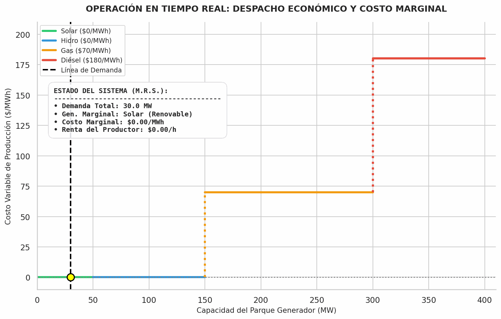

Este es el primer artículo de una serie sobre el mercado mayorista salvadoreño:
las reglas, el mecanismo de formación de precio y los procesos operativos que
están debajo. Empieza por el mapa porque todo lo que sigue depende de saber qué
entidad emite qué.

## Cuatro funciones, y quién las tiene

La idea ordenadora es la separación de actividades. Antes de la reforma de
finales de los noventa, una sola entidad estatal generaba, transmitía,
distribuía y fijaba las condiciones. La reforma partió eso en dos grupos: las
actividades que pueden ser competitivas —generación y comercialización— y las
que son monopolios naturales —transmisión y distribución—. Después creó
instituciones para vigilar la frontera entre ambos.

De ahí salen cuatro funciones que alguien tiene que ejercer:

| Función | Titular | Nota |
|---|---|---|
| Política sectorial | DGEHM | Absorbió al antiguo Consejo Nacional de Energía |
| Regulación y supervisión | DGEHM desde julio de 2026 | Antes, SIGET |
| Operación del sistema y administración del mercado | Unidad de Transacciones | Sociedad privada, S.A. de C.V. |
| Propiedad y mantenimiento de la transmisión | ETESAL | 115 kV y 230 kV |

La distinción que más pesa en el día a día es la que separa la tercera fila de
la segunda. **La UT opera el sistema y administra el mercado. No lo regula.**

La diferencia se vuelve concreta apenas hay un desacuerdo. Cuando la UT publica
una indexación o valida un costo declarado, está aplicando una regla que aprobó
alguien más. Si un participante disputa esa aplicación, la disputa no se
resuelve en la UT: sube al regulador. La UT ejecuta el reglamento; no lo
escribe ni lo interpreta con autoridad final.

La UT empezó a operar en 1998 y su forma jurídica llama la atención: es una
sociedad anónima privada que administra un mercado de interés público. Esa
mezcla —gobernanza privada, función pública— es poco común y conviene entenderla
antes de asumir cómo se toman las decisiones adentro.

## La reforma de julio de 2026

Vale dejarla por escrito con precisión, porque es lo bastante reciente como para
que casi todo el material publicado todavía no la haya alcanzado.

El traslado ocurrió en dos etapas, y confundirlas es fácil.

**Primera etapa: la política.** La DGEHM fue creada por el Decreto Legislativo
No. 190 del 26 de octubre de 2021, publicado en el Diario Oficial No. 212, Tomo
433, del 8 de noviembre de 2021, con vigencia un año después de la publicación.
Ese decreto disolvió el Consejo Nacional de Energía y la dirección de
hidrocarburos y minas del Ministerio de Economía, y trasladó sus competencias al
nuevo ente. Hasta ahí, lo que se consolidó fue la política sectorial. La
regulación siguió en SIGET.

**Segunda etapa: la regulación.** El 2 de julio de 2026 la Asamblea Legislativa
aprobó, con 57 votos, reformas a ambas leyes de creación que trasladan también
la función reguladora en electricidad a la DGEHM. Lo operativo:

- Las facultades regulatorias, administrativas y registrales sobre electricidad
  pasan a la DGEHM, junto con expedientes, archivos, bienes y recursos.
- La transición tiene un plazo máximo de seis meses, coordinada por una comisión
  especial. Contado desde la aprobación, eso llega a principios de 2027.
- Cualquier referencia a SIGET en la legislación eléctrica, en contratos o en
  convenios debe leerse como referencia a la DGEHM.
- SIGET pasa a llamarse Superintendencia General de Telecomunicaciones, conserva
  la sigla y retiene únicamente competencias de telecomunicaciones.
- Los procesos judiciales ya iniciados se quedan en SIGET; los administrativos se
  trasladan.

Para quien esté leyendo el corpus regulatorio ahora mismo, la consecuencia
práctica es sencilla y algo incómoda: **los documentos dicen SIGET y quieren
decir DGEHM**, y la transición sigue corriendo mientras esto se escribe.

## Dos mercados bajo un mismo techo

El mercado mayorista no es un solo lugar de negociación. Son dos, y los
administra la UT.

El **Mercado de Contratos** es a plazo. Los participantes negocian
bilateralmente, con independencia de la UT, y la UT despacha el resultado. La
cantidad, la duración y el precio son de las partes.

El **Mercado Regulador del Sistema** es de corto plazo: el mercado spot. Cada
hora, alguien consumió más o menos de lo que sus contratos cubrían, y algún
generador produjo más o menos de lo que se comprometió. El MRS liquida esa
brecha a un precio que varía hora a hora.

La relación entre los dos merece enunciarse despacio, porque es donde se tropieza
casi todo el mundo al principio.

Un contrato es un arreglo financiero entre dos partes. **No determina qué máquina
opera.** El despacho se decide de forma centralizada y por mérito económico, sin
mirar quién tiene contrato con quién. Un generador con contrato puede no ser
despachado; uno sin contrato puede operar todo el día. El contrato define quién
le paga a quién, y el MRS reconcilia la diferencia entre la posición contractual
y la física.

Dicho de otro modo: los contratos y el despacho responden a lógicas distintas y
se encuentran recién en la liquidación.

## Quiénes participan

Los participantes se agrupan en cinco categorías: generadores, transmisores,
distribuidores, comercializadores y usuarios finales conectados directamente a
la red de transmisión. Todos transan en el mercado mayorista a través de la UT.

La distribución está concentrada en un puñado de empresas con territorios
definidos. La generación está más fragmentada, y su composición cambió de manera
importante en los últimos años con la entrada de capacidad grande a gas natural
y una participación creciente de solar.

## Por qué costos y no ofertas

Esta es la decisión de diseño que da forma a todo el resto de la serie, y la que
más conviene entender como principio antes que como regla.

**En un mercado por ofertas**, los generadores presentan precios libremente. El
operador apila las ofertas de menor a mayor y la intersección con la demanda fija
el precio. La disciplina viene de la competencia: si ofertás demasiado alto, no
te despachan. Eso funciona con dos condiciones — que haya suficientes
competidores independientes para que ninguno mueva el precio por sí solo, y que
la tecnología marginal tenga costos difíciles de ocultar.

**En un mercado por costos**, los generadores no ofertan un precio. Declaran sus
costos —precio del combustible, eficiencia, costos variables no combustibles— y
el operador construye el orden de mérito con esos costos declarados. La
disciplina ya no viene de la competencia sino de la verificación: la declaración
tiene que estar documentada, ser auditable, y el operador la valida contra
referencias aprobadas.

El intercambio entre ambos esquemas es directo. Un mercado por ofertas es barato
de administrar y le confía la disciplina a la competencia. Un mercado por costos
es caro de administrar —alguien tiene que auditar a cada generador y validar cada
declaración— y le confía la disciplina a la verificación.

Los sistemas pequeños, con generación concentrada y una tecnología marginal que
quema combustible importado, tienden al segundo esquema, y por dos razones que se
refuerzan. Con pocos competidores, la competencia sola no disciplina las ofertas.
Y cuando la unidad marginal quema combustible importado, su costo es observable
desde afuera, lo que vuelve factible la verificación de un modo que no lo sería
para, digamos, una hidro con embalse.

El Salvador opera bajo el **Reglamento de Operación del Sistema de Transmisión y
del Mercado Mayorista Basado en Costos de Producción** — el ROBCP. El nombre
enuncia el diseño: costos de producción, no ofertas. El precio de la energía en
el mercado mayorista es variable, y lo fija el costo marginal hora a hora.

<figure class="fig fig-wide">
  
  <figcaption>El orden de mérito en movimiento: la demanda barre la curva de
  oferta y el costo marginal es el de la última unidad que entra, no el promedio
  de las despachadas. Mientras la demanda cae sobre solar o hidro el precio es
  cero; cuando cruza a gas o a diésel salta al costo de esa máquina — y ese
  precio lo cobran también las unidades más baratas.
  <strong>Las cifras son ilustrativas y no corresponden a El Salvador</strong>:
  el parque es un ejemplo de cuatro tecnologías para mostrar el mecanismo. Cómo
  se construye realmente el orden de mérito, y qué lo rompe, es el artículo
  siguiente.</figcaption>
</figure>

El reglamento no es nuevo ni es estable. Fue aprobado por el **Acuerdo SIGET
No. 232-E-2008** del 23 de octubre de 2008 y publicado por primera vez en el
Diario Oficial No. 144, Tomo 384, del 31 de julio de 2009, pero **su aplicación
empezó hasta el 1 de agosto de 2011** — casi tres años después de aprobado. Al
entrar en vigencia desplazó al reglamento anterior, el del Acuerdo No. E-13-99
de 1999, que era el esquema con el que arrancó el mercado tras la reforma.

Desde entonces acumula alrededor de treinta acuerdos modificatorios. Los
primeros los emitió SIGET; los más recientes, la DGEHM. La versión que publica
la UT está actualizada a junio de 2026 e incorpora como último cambio el Acuerdo
No. 73/2026/DE. Quien cite el ROBCP tiene que decir qué versión leyó.

Y acá está la bisagra de toda la serie. Si el precio sale de costos declarados,
la integridad del precio depende por completo de la integridad de las
declaraciones. Validar una declaración deja de ser un trámite administrativo y
pasa a ser **el mecanismo por el cual el mercado funciona**.

## Qué implica esto para el resto de la serie

El mapa de arriba genera las preguntas que los artículos siguientes tienen que
responder.

Si el precio lo fija el costo marginal, ¿cómo se construye realmente el orden de
mérito y qué lo rompe? Ese es el próximo artículo.

Si los costos se declaran en vez de ofertarse, ¿qué declara exactamente un
generador, con qué frecuencia, contra qué referencia y con qué respaldo
documental? Ese es el núcleo de la serie, y la razón por la que existe.

Si las declaraciones se validan contra estructuras aprobadas, ¿quién aprueba esas
estructuras, cada cuánto se revisan y qué pasa entre revisiones?

Y si todo esto produce un precio horario, ¿cómo se convierte ese precio en una
liquidación mensual, y dónde encaja el mercado regional?

> El mapa institucional no es contexto de fondo. En un mercado por costos, saber
> quién aprueba qué es la diferencia entre validar una declaración y solamente
> recibirla.

## Fuentes

- **Reglamento de Operación del Sistema de Transmisión y del Mercado Mayorista
  Basado en Costos de Producción (ROBCP)**, versión actualizada a junio de 2026.
  Unidad de Transacciones.
  [PDF](https://www.ut.com.sv/documents/10100/279097/ROBCP.pdf/129acc69-cb01-7ed4-7080-88be586df4ec?t=1729522985515).
  Portada e introducción: acuerdo de aprobación, publicación en Diario Oficial,
  fecha de inicio de aplicación y listado de acuerdos modificatorios. Consultado
  el 22 de agosto de 2026.
- **Unidad de Transacciones** — [Qué hacemos](https://www.ut.com.sv/que-hacemos)
  y [Marco regulatorio](https://www.ut.com.sv/marcoregulatorio). Funciones de la
  UT y categorías de participantes. Consultado el 22 de agosto de 2026.
- **SIGET** — [Gerencia de Electricidad](https://www.siget.gob.sv/gerencias/electricidad/gerencia-de-electricidad/).
  Definición del mercado mayorista, Mercado de Contratos y MRS. Consultado el 22
  de agosto de 2026.
- **Asamblea Legislativa de El Salvador** — [reforma que traslada las
  competencias eléctricas a la DGEHM](https://www.asamblea.gob.sv/node/14035).
  Aprobada el 2 de julio de 2026. Consultado el 22 de agosto de 2026.
- **Decreto Legislativo No. 190** del 26 de octubre de 2021, Diario Oficial
  No. 212, Tomo 433, del 8 de noviembre de 2021 — creación de la DGEHM y
  disolución del Consejo Nacional de Energía.
- **ETESAL** — [sitio institucional](https://www.etesal.com.sv/). Propiedad de
  la transmisión y niveles de tensión.

El registro completo de documentos primarios de la serie, con su estado de
verificación, está en [Fuentes primarias](../fuentes).
