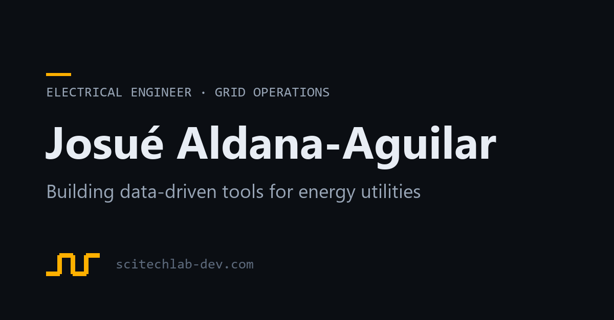

This file has `draft: true`, so the build skips it and it never reaches the
site. Copy it to start a real article, drop the `draft` line, and push.

The file name becomes the URL: `content/relay-setting-groups.md` is published at
`/articles/relay-setting-groups` — no `.html`. A `2026-08-16-` prefix on the file
name is allowed and gets stripped — useful if you want the folder sorted by date.

## What you can write

Everything the site already styles: **bold**, *italic*, `inline code`, links
like [ORCID](https://orcid.org/0000-0002-7686-5065), and lists.

- Bullets
- Work as expected

1. So do numbered lists
2. In the same body style

> Blockquotes are styled too — use them for a line worth pulling out.

Code blocks keep their monospace box:

```python
threshold = 0.85
if pf < threshold:
    flag(feeder)
```

Images go in `assets/` and are referenced from there:



## What matters in the front matter

`title`, `summary` and `date` are required — the build fails loudly if one is
missing, rather than publishing a page with an empty preview card. `topic` shows
next to the date and is optional. `slug` is optional and only needed if you
rename the file after sharing the link somewhere.
